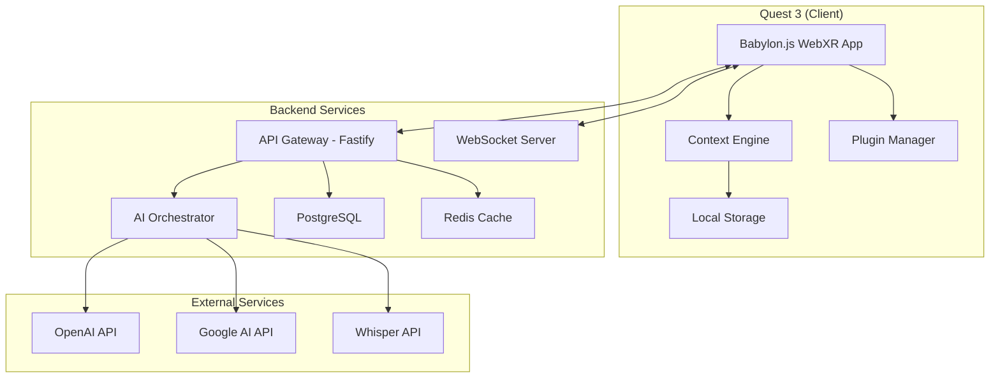
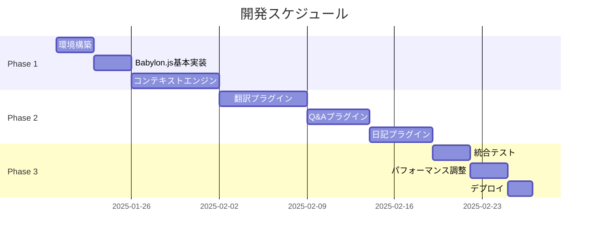

# TransXR システム設計書

## 1. システムアーキテクチャ

### 1.1 全体構成



### 1.2 レイヤー構成

```yaml
Presentation Layer:
  - Babylon.js Scene
  - React UI Components
  - AR Overlays

Application Layer:
  - Context Engine
  - Plugin System
  - State Management (Zustand)

Domain Layer:
  - Business Logic
  - AI Model Selection
  - Data Processing

Infrastructure Layer:
  - WebXR APIs
  - IndexedDB
  - WebSocket Client
  - HTTP Client
```

## 2. データモデル

### 2.1 コンテキストデータ

```typescript
interface ContextEntry {
  id: string;
  timestamp: Date;
  type: 'visual' | 'audio' | 'text' | 'action';
  
  // Visual Context
  visual?: {
    imageUrl: string;
    thumbnail: string;
    objects: DetectedObject[];
    text: string[];  // OCR結果
  };
  
  // Audio Context  
  audio?: {
    transcript: string;
    speaker?: string;
    language: string;
    confidence: number;
  };
  
  // Metadata
  metadata: {
    location?: GeolocationCoordinates;
    activity?: string;
    tags: string[];
    importance: number; // 0-1
  };
  
  // Relations
  sessionId: string;
  userId: string;
}

interface DetectedObject {
  label: string;
  confidence: number;
  boundingBox: BoundingBox;
}
```

### 2.2 プラグインデータ

```typescript
interface Plugin {
  id: string;
  name: string;
  version: string;
  type: 'native' | 'third-party';
  
  config: {
    enabled: boolean;
    permissions: Permission[];
    settings: Record<string, any>;
  };
  
  manifest: {
    displayName: string;
    description: string;
    icon: string;
    author: string;
  };
}

interface TranslationSession {
  id: string;
  startTime: Date;
  endTime?: Date;
  
  languages: {
    source: string;
    target: string;
  };
  
  messages: TranslationMessage[];
}

interface DiaryEntry {
  id: string;
  date: Date;
  
  content: {
    summary: string;
    highlights: Highlight[];
    emotions: EmotionAnalysis;
    photos: string[];
  };
  
  metadata: {
    wordCount: number;
    locations: string[];
    people: string[];
    tags: string[];
  };
}
```

## 3. API設計

### 3.1 REST API

```yaml
# Context API
POST   /api/context/capture
GET    /api/context/search
GET    /api/context/{id}
DELETE /api/context/{id}

# Plugin API  
GET    /api/plugins
POST   /api/plugins/{id}/enable
POST   /api/plugins/{id}/disable
PUT    /api/plugins/{id}/settings

# Translation API
POST   /api/translate
GET    /api/translate/languages
POST   /api/translate/session/start
POST   /api/translate/session/{id}/end

# Q&A API
POST   /api/question
GET    /api/question/history

# Diary API
GET    /api/diary/entries
GET    /api/diary/{date}
POST   /api/diary/{date}
PUT    /api/diary/{date}
```

### 3.2 WebSocket Events

```typescript
// Client -> Server
interface ClientEvents {
  'context:capture': {
    type: 'visual' | 'audio';
    data: Blob;
    metadata: any;
  };
  
  'translate:stream': {
    audio: ArrayBuffer;
    language?: string;
  };
  
  'question:ask': {
    question: string;
    context?: string;
    imageRef?: string;
  };
}

// Server -> Client  
interface ServerEvents {
  'context:processed': {
    id: string;
    result: ContextEntry;
  };
  
  'translate:result': {
    text: string;
    language: string;
    confidence: number;
  };
  
  'question:answer': {
    answer: string;
    sources: string[];
    confidence: number;
  };
}
```

## 4. セキュリティ設計

### 4.1 認証・認可

```typescript
// JWT Token Structure
interface AuthToken {
  sub: string;      // User ID
  iat: number;      // Issued at
  exp: number;      // Expiration
  scope: string[];  // Permissions
}

// Permission Model
enum Permission {
  CONTEXT_READ = 'context:read',
  CONTEXT_WRITE = 'context:write',
  PLUGIN_MANAGE = 'plugin:manage',
  DIARY_WRITE = 'diary:write',
  SETTINGS_MODIFY = 'settings:modify'
}
```

### 4.2 データ保護

```yaml
暗号化:
  通信: TLS 1.3
  保存時: AES-256-GCM
  
プライバシー:
  顔認識: 自動ぼかし処理
  音声: ローカル処理優先
  位置情報: 精度制限オプション
  
アクセス制御:
  API: Rate Limiting (100 req/min)
  Storage: Quota Management (1GB/user)
  Session: Timeout (30min)
```

## 5. デプロイメント

### 5.1 開発環境

```yaml
Local Development:
  Frontend: Vite Dev Server
  Backend: Node.js + Nodemon
  Database: Docker PostgreSQL
  Cache: Docker Redis
  Tunnel: ngrok (Quest testing)
```

### 5.2 本番環境

```yaml
Production:
  Frontend: 
    - Vercel (Static Hosting)
    - CloudFlare CDN
  Backend:
    - Railway/Render (Node.js)
    - Managed PostgreSQL
    - Upstash Redis
  Monitoring:
    - Sentry (Error Tracking)
    - LogRocket (Session Replay)
```

## 6. 開発スケジュール

